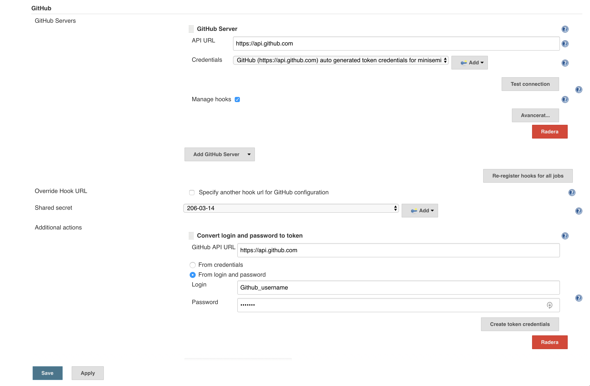

Test edit with jenkins integration.


# Repo for Continious Integration in TDDE06 lab series

*Made by: Fredrik Håkansson (freha309) and Alexander Ulander (aleul850)*

## Scenario:
Imagine that you have a large scale software project with multiple developers where when everytime you make changes, you have to manually go through the whole tedious cycle of e.g.:
1. uploading the new code to github
2. getting the new code to your server 
3. testing it with the new code 
4. updating the server with the new code if the tests are successfull
5. restarting the servers
6. notifying the other developers about the changes 

Now imagine that instead of doing all of these steps after every push, you have a system that triggers on your push and performs all of your desired code integration steps automatically. Well, now you can. Introducing continous integration (CI) - with Docker and Jenkins.

## How-To:
### Introduction
This is a tutorial of how to set up a Continious Integration platform which will be able to perform the following workflow:

1. A developer pushes to the GitHub repository.
2. As an answer to the new changes in the repository, Jenkins will pull the new code and build the application with Docker.
3. A Jenkins slave will build the system and run the tests.
4. The developers will be notified by the result of the test via email or Slack.

> #### We recommend to execute this tasks on a Linux or Unix system.

The project we will work with is the [example project for the course](https://gitlab.ida.liu.se/large-scale-dev/ci-sample-project) which you can read more about via the link. Shortly it is a very simple web server written in Golang with a PostgreSQL database and a NGINX server proxy.

### Step 1: Installing

#### Docker
First of all you need to install Docker from [Docker's home page](http://www.docker.com). Pick a version that suits your system.

- Docker training videos: https://training.docker.com/self-paced-training
- Getting started:
	- Linux: https://docs.docker.com/linux/
	- OS X: https://docs.docker.com/mac/
	- Windows: https://docs.docker.com/windows/
- Official documentation: https://docs.docker.com

In the course TDDE06 you can use a server for running Docker provided by IDA. More information [here](http://www.ida.liu.se/~TDDE06/labs/ci-lab1.shtml)

#### Jenkins
Install Jenkins from [Jenkins.io](https://jenkins.io/). Install it on a machine that is reachable over the internet (not only on your `localhost`). It is possible to run Jenkins in a Docker container on the same server provied above or on a server you deploy. We will configure Jenkins in a later step so just make sure you can run Jenkins and access it's web interface for now.


### Step 2: Create GitHub project
We start off with creating a GitHub project. Feel free to download and copy this repository for your use or choose another project. The rest of this turorial will use this repository.

### Step 3: Prepare Jenkins Slave
In order to run our tests and deploy our project we need a Jenkins slave that will execute all our commands such as launching our Docker images and run our unit tests. We have chosen to run a docker image as a Jenkins slave and will execute our other three Docker images insinde this Docker image, also known as Docker-in-Docker(DinD). 

Start by SSH in to our server running Docker on IDA with following:
```sh
ssh <LiU id>@130.236.181.180
```
Pull down the [Jenkins slave docker image](https://hub.docker.com/r/tehranian/dind-jenkins-slave/) which allows to run DinD and holds the neccesary packages to run as a Jenkins slave by running
```sh
docker pull tehranian/dind-jenkins-slave
```
We now have the image on the server and can run it by executing the following command:
```sh
docker run -t jenkins-slave -p 53022:22 -p 80:80 -d --privileged tehranian/dind-jenkins-slave
```
The flags `-p` means we forwards a port from the system to a port on the container (running image). In this case we enable us to SSH directly into to Docker cointainer later. If we run `ssh user@130.236.181.180:53022` it means we connect to port 22 on the container and thus SSH into the container instead if the server holding the container. The `-d` means "detatch" and makes the container running in the background and not directly in our terminal window. 

### Step 4: Configure Jenkins
Next, we are going to set up Jenkins and creating some jobs.

#### Set up Jenkins environment
On the machine you set up Jenkins, browse to its port 8080. For example if you set up on your computer you enter `localhost:8080` in your browser. This will take us to the startup page of Jenkins and will demand a `initialAdminPassword`. Instructions on how to find this are displayed in the browser. In the next step we recommend that you choose to **Install suggested plugin**. Then create a admin user of your choice. 

Great, now we should have a initial configuration set up in Jenkins. For our project we will need to install some additional plugins in Jenkins. To perform this, go to *Manage Jenkins --> Manage Plugins --> Available*. Among these we want to install **GitHub Plugin** and **Slack Notification Plugin**. If they are not present in the *available* tab check in the *installed* tab. Then it is already installed.

#### Create slave
We will now connect our jenkins-slave image started in step 3 as a slave in Jenkins. To do this we go to *Manage Jenkins --> Manage Nodes* and then click *New Node* in the left panel. Give it a name like "Docker slave" and mark *Permanent Agent*. Fill in the fields as follows:

* **# of executors:** 1

* **Root directory:** /home/jenkins

* **Usage:** Use this node as much as possible

* ** Launch method:** Launch slave agents via SSH**
	* **Host:** 136.236.181.180
	* **Credentials:** click add and fill in username and password for jenkins user on slave image.
	* Also click "Advanced" and change port to **53022**
* **Availability:** Keep this agent online as much as possible

Click *Save* and we should now have our slave set up.

#### System configurations
Except for a slave we need to set up some other things. Go to *Manage Jenkins --> Configure System*

##### Github
To set up access to our Github account and repo we need to add some settings. Either follow the plugins guide on [this page](https://wiki.jenkins-ci.org/display/JENKINS/Github+Plugin) or compare with the image below on what values are needed.



##### Slack
In order to send notifications to Slack when a job is successfull or fails we need to condigure Slack as well. Scroll down to *Global Slack Notifier Settings* and fill in the fields:

* **Team Subdomain:** Url of your channel. If you connent to as in our case via http://tdde06-ci.slack.com `tdde06-ci` is your value.
* **Integration Token:** Can be retrieved from the Integration settings panel of your Slack team.
* **Channel:** #channel or similar where you want your notification to be posted.

### Step 5: Create Jenkins job
So, now we have configured and tweaked everything and it is time to create the Jenkins job. 

From the Jenkins startpage click "New Item". Name your project something like "Test" or something. Select *Freestyle project* and click OK. We have now reached the configuration page for the Jenkins job and here is where the magic happens. We will now walk through the different settings we used.

1. Check the box *GitHub project* and paste the URL to the GitHub repository. For our project it would be `https://github.com/minisemi/TDDE06`.

2. Check the box *Restrict where this project can be run*. Then type the name of the slave we created earlier in the field *Label Expression*. This forces our job to be runned by our slave.

3. Under "Source code management" check the box for **Git**. 
	* **Repository URL:** Again we paste the URL to the GitHub repository but this time ending with `.git`.
	* **Credentials:** Username and password for your GitHub account. 
	* **Branches to build-->Branch specifier:** */master

4. Under *Build Triggers* check box for **GitHub hook trigger for GITScm polling**.

5. Under *Build* click *Add build step* and select **Execute shell**.
	* In the command field add:
	```sh
	# Build Docker images
	cd go
	docker build -t heekzz/tdde06_go .

	cd ../postgres
	docker build -t heekzz/tdde06_postgres .

	cd ../nginx
	docker build -t heekzz/tdde06_nginx .

	# Stop containers if running
	docker stop pg_server_test || true && docker rm pg_server_test || true
	docker stop go_server_test || true && docker rm go_server_test || true

	# Run postgres test database
	docker run --name pg_server_test -it -d heekzz/tdde06_postgres

	# Wait for database to start
	sleep 5

	# Run Go server tests
	docker run --name go_server_test --link pg_server_test:db heekzz/tdde06_go go test

	# Stop database container
	docker stop pg_server_test
	docker rm pg_server_test
	docker rm go_server_test
	```
	* The Jenkins job will now exeute all commands in the shell on the slave (our Docker container), just like we launched the Jenkins-slave Docker image. But instead the images contains our database, Golang and NGINX servers.

5. Lastly we want to report the result from the build to our Slack channel. 
	1. Under *Post-build Actions* click *Add post-build action* and select **Slack Notifications**.
	2. Check the notications you want to post to the Slack channel. 

Now you should be able to start a Jenkins job and get notifications in Slack when the build is done. Lastly we are going to add a GitHub webhook that trigger the build automatically when a commit is pushed to the repository.


### Step 6: Add webhooks from GitHub
Now you want to set up the trigger of your CI, to be when you push changes to your GitHub project. To set this up, go to your desired GitHub repository's settings. Now choose "Integrations & services", press "Add service", search for "jenkins github" and select the only search result that pops up. Now add the Jenkins hook url, which will be the url for where your jenkins master is located along with an optional port number and github-webhook path (e.g. http://myserver.se:8080/github-webhook/), and finally add the service.
